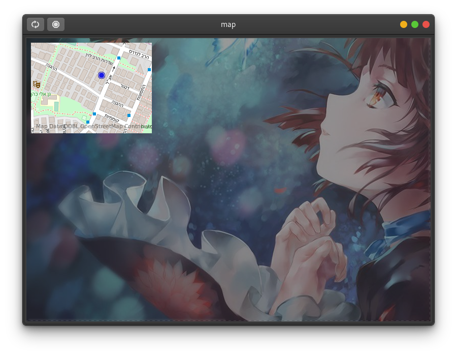
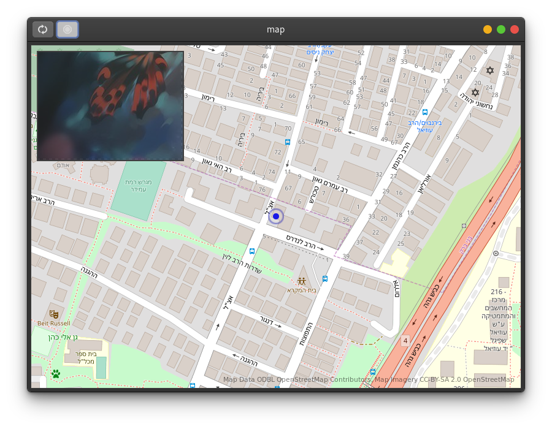

# drone-driver

## Description

A gtk application for driving the drone remotely.

With this app, you can see the location, and the vision of the drone (the video stream the drone recorded). And you can control the drone with a game pad or a joystick controller with another small app (That's my plan). 

## Preview

|  |  |
| :----------------------------------------------------------: | :----------------------------------------------------------: |
|                         Floating map                         |                          Tiled map                           |

## Build & Run & Installation

Dependence

- gtk+-3.0
- libchamplain-0.12
- libchamplain-gtk-0.12
- clutter-1.0
- clutter-gtk-1.0
- gstreamer-1.0

Build

```shell
git clone https://gitlab.com/yiwenxue/drone-driver.git

cd drone-driver
meson build && cd build
ninja 
```

Run

```shell
cd build/src
./dronesimulation
```

## Todo

- [x] Show the drone in map
- [ ] Show the vision with gstreamer 
